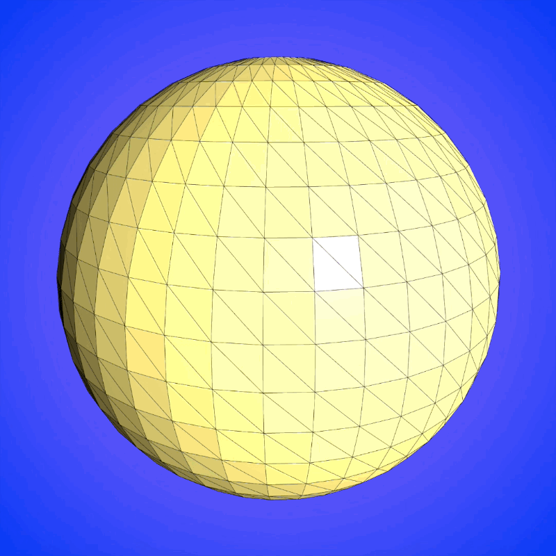

# ofxCorkCsg

Constructive solid geometry (mesh boolean) addon for openFrameworks v0.10+ based on [this fork](http://https://github.com/CloudCompare/cork) of the Cork library.

## Usage

The addon includes mesh generation functions that create meshes that will work "out of the box" with the boolean operations:

* **cylinder(ofMesh& mesh, float height, float radius)**
* **void sphere(ofMesh& mesh, float radius)**
* **void box(ofMesh& mesh, float width, float height, float depth)**
* **void octohedron(ofMesh& mesh, float width, float height)**

To use the library, generate a mesh and then execute one of the operations.

```cpp
// create box
ofxCorkCsg::box(boxMesh, 150.f, 150.f, 150.f);

// create sphere
ofxCorkCsg::sphere(sphereMesh, 100.f);

// out mesh
ofMesh outMesh;

// result = A U B
ofxCorkCsg::computeUnion(boxMesh, sphereMesh, outMesh);

// result = A - B
// ofxCorkCsg::computeDifference(boxMesh, sphereMesh, outMesh);

// result = A ^ B
// ofxCorkCsg::computeIntersection(boxMesh, sphereMesh, outMesh);

// result = A XOR B
// ofxCorkCsg::computeSymmetricDifference(boxMesh, sphereMesh, outMesh);
```

## Cork Mesh Format

The boolean functions that take **ofMesh** objects as input convert them to Cork's mesh format, **CorkTriMesh**. This conversion copies the vertices and indices. If you are going to be doing repeated operations on meshes that do not change then it would be more efficient to convert them to **ofxCorkCsg::MeshWrapper** objects and call the boolean functions on those.

```cpp
ofMesh in0Mesh, in1Mesh, outMesh;

// generate or load in0 and in1 here

ofxCorkCsg::MeshWrapper in0Wrapper(in0Mesh);
ofxCorkCsg::MeshWrapper in1Wrapper(in1Mesh);
ofxCorkCsg::computeUnion(in0Wrapper, in1Wrapper, outMesh);
```

The wrapper contains an instance of Cork's native **CorkTriMesh** that is publicly accessible as **wrapper.corkTriMesh**.

## Mesh Requirements

If you decide to use a mesh that is not generated by the addon then it needs to satisfy the following requirements:
* Wateright
* Counter-clockwise triangle winding
* Shared vertices
* Primitive mode OF_PRIMITIVE_TRIANGLES

The **ofxCorkCsg::unifyVertices(const ofMesh& inMesh, ofMesh& outMesh)** function will share a mesh's vertices for you.
```cpp
ofMesh nonSharedMesh;

// generate or load nonSharedMesh here

ofMesh sharedMesh;

ofxCorkCsg::unifyVertices(nonSharedMesh, sharedMesh);
```

If you are unsure whether a mesh you are working with satisfies Cork's requirements, the Cork API has an **isSolid(CorkTriMesh mesh)** function that will check the mesh and log any problems.

```cpp
ofMesh isThisOk;

// generate or load mesh here

ofxCorkCsg::MeshWrapper wrapper(isThisOk);

isSolid(wrapper.corkTriMesh);
```

## Compatibility
The addon is compatible with openFrameworks v0.10, at the time of writing, this is the [master branch on github](https://github.com/openframeworks/openFrameworks) rather than the stable download from the website.

Cork is dependent on the [GMP library](https://gmplib.org/) and at the moment only the OSX version is included here.

---
Feel free to give me some Bitcoins if you like the addon - 1FxuEpubUwhPaqwmqABvwGmoMcEEMPgxjN
